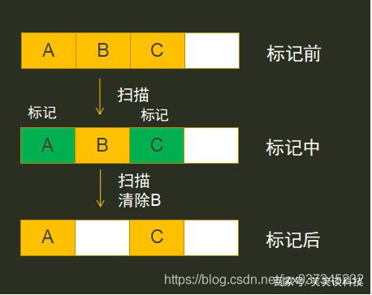
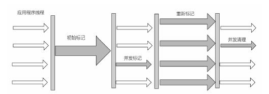
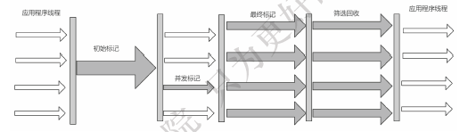

# 3.JVM原理以及性能调优
常见面试题：
> https://blog.csdn.net/jzx937345232/article/details/104795162

## 3.1 简述JDK,JRE,JVM之间的关系

   * JDK(Java Development Kit) 是 Java 语言的软件开发工具包
   * Jre是Java运行环境
   * JVM是一种用于计算设备的规范,是通过在实际的计算机上仿真模拟各种计算机功能来实现的

## 3.2 描述类加载机制的含义和过程

   * 类加载：通过类的全限定名获取其定义的二进制字节流，
   * 需要借助类加载器完成，就是用来装载class文件的，通过双亲委派机制加载
   
## 3.4 常用的垃圾回收算法有哪些

### 3.4.1 标志清除
     标记清除 : 扫描所有对象,进行标记,然后移除, 内存不连续 会有碎片

### 3.4.2 复制算法
     将内存复制为2份,当其中一份内存占用满了 会将非垃圾对象移到另一份中,然后清空当前内存区域
     
     
### 3.4.3 标记整理
     标记过程仍然与 1- "标记-清除"算法一样，但是后续步骤不是直接对可回收对象进行清理，而是让所有存活 的对象都向一端移动，然后直接清理掉端边界以外的内存

### 3.4.4 分代收集算法
    Young区：复制算法 (对象在被分配之后，可能生命周期比较短，Young区复制效率比较高)
    Old区：标记清除或标记整理(Old区对象存活时间比较长，复制来复制去没必要，不如做个标记再清理)

## 3.5 说说常用的垃圾收集器，以及它们适用的区域和特点

* Serial收集器 : 古老 单核 单线程 STW较长

* ParNew收集器 : Serial的多线程版本 比较多使用
  优点：在多CPU时，比Serial效率高。 缺点：收集过程暂停所有应用程序线程，单CPU时比Serial效率差。
  算法：复制算法 适用范围：新生代
  
* ParNew ScavengeScavenge 收集器 新生代 Parallel Scanvenge更关注系统的吞吐量。

* Serial Old 收集器 老年代

* Parallel Old 收集器 ParNew ScavengeScavenge收集器 老年代版本

* CMS收集器
  并发收集器 会初始化标记, 然后gc线程和用户线程同时工作 在最后进行gc 之前会再次确认标记 stw 更小
  
  
* G1收集器 jdk>1.8 JVM默认垃圾回收
    G1 可以自定义设置gc线程总的消耗时间 (不要太小, 太小会导致频繁,频繁gc)
 它将整个Java堆划分为多个大小相等的独立区域（Region），虽然还保留有新生代和老年代的概念，但新生代和老年代不再
 是物理隔离的了，它们都是一部分Region（不需要连续）的集合
 
 
 
 
## 3.6 JVM常用的参数类型有哪些
    -Xms1000等价于-XX:InitialHeapSize=1000
    -Xmx1000等价于-XX:MaxHeapSize=1000
    -Xss100等价于-XX:ThreadStackSize=100
    
    
## 3.7 JVM中常用的命令和工具有哪些，并说出它们的作用?
    jps 查看java 进程
    Jinfo 查看jvm启动参数
    jstat 查看 虚拟机性能(GC 日志) –class 查看类加载信息
    Jstack 查看进行的堆栈信息
    jmap 查看当前堆内存 使用情况
    
jconsole(JDK自带) MAT(下载连接以及使用方法[MAT使用方法以及jmap使用](https://blog.csdn.net/jzx937345232/article/details/102741496))
GCViewer日志分析官网[下载地址](https://sourceforge.net/projects/gcviewer/)

## 3.9 JVM 参数及调优

> https://www.cnblogs.com/coding-diary/p/11815961.html

 
   

