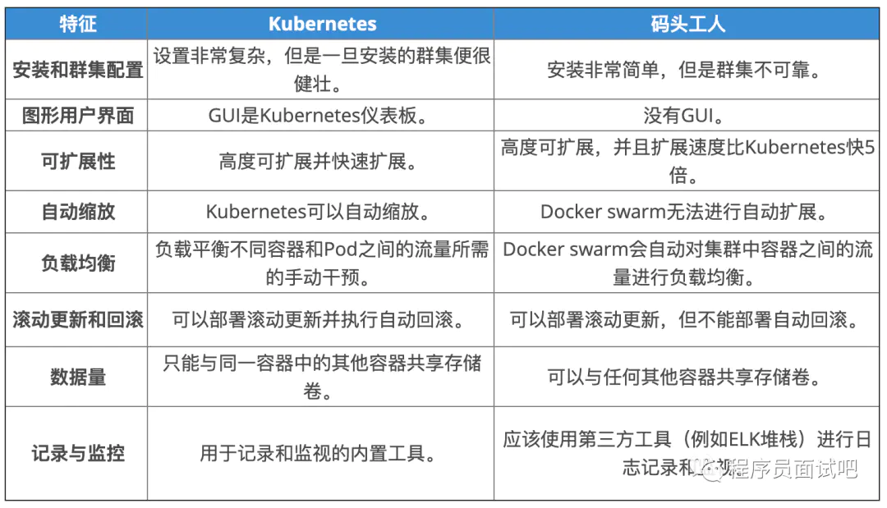
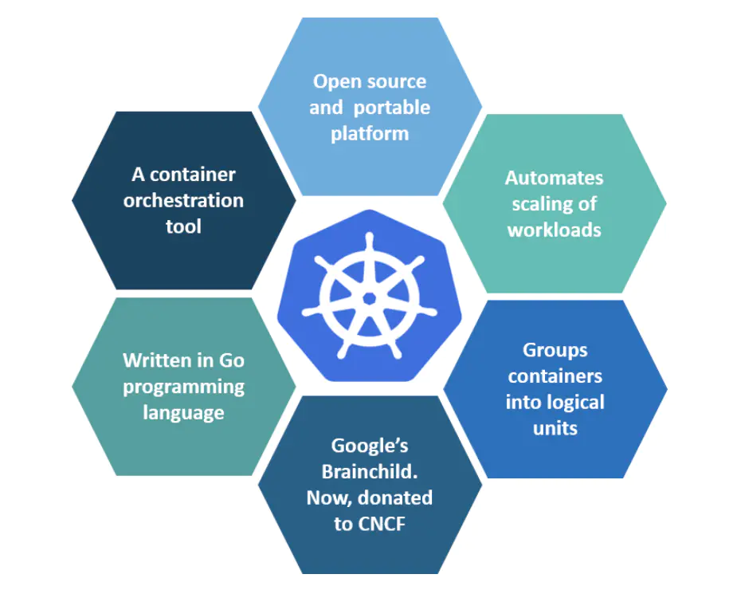

# 86. kubernetes
  常见面试题
 > https://wenku.baidu.com/view/a6a206eca2116c175f0e7cd184254b35eefd1a88.html

 > https://zhuanlan.zhihu.com/p/115826751

 > https://blog.csdn.net/easylife206/article/details/97723598

## 86.1 Kubernetes基本面试问题

## 86.1.1 Kubernetes与Docker Swarm有何不同？

   
   
   
## 86.1.2 什么是Kubernetes？

   
   
   Kubernetes是一个开源容器管理工具，它负责容器部署，容器的缩放以及负载平衡的职责